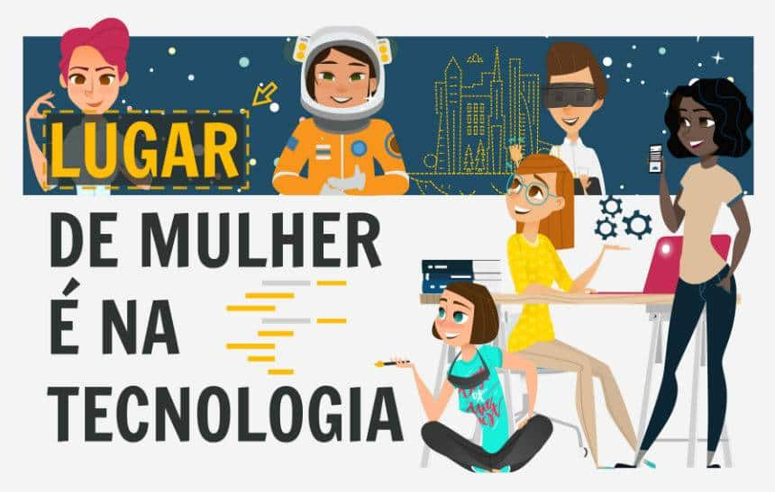

# Olá, eu sou a Nayane 👋

## 🚀 Sobre mim

Estou em transição para a área de Tecnologia, unindo a experiência em Administração e área fiscal com uma verdadeira paixão por inovação digital. Atualmente, estou cursando MBA em Gestão de Projetos e um Bootcamp Full Stack JavaScript, onde tenho me aprofundado em programação, desenvolvimento de APIs e metodologias ágeis.

Sou uma profissional proativa, curiosa e dedicada, sempre em busca de aprender e aprimorar minhas habilidades para enfrentar desafios e entregar resultados de impacto.

## 💻 Tecnologias que domino

## 🌟 Habilidades adicionais

- 🧩 **Programação Orientada a Objetos (POO)**
- 💻 **Desenvolvimento Full Stack**
- 🔍 **Análise e melhoria de processos**
- 🤝 **Comunicação efetiva e trabalho em equipe**

## 📫 Me encontre por aqui

- 📧 Email: [nayane_rms@hotmail.com](mailto:nayane_rms@hotmail.com)  
- 🔗 LinkedIn: [linkedin.com/in/nayanerodriguesoi](https://linkedin.com/in/nayanerodriguesoi)  
- 🐱 GitHub: [github.com/nayaneoi ](https://github.com/nayaneoi )

---

*Vamos construir o futuro da tecnologia juntos! 🚀*
